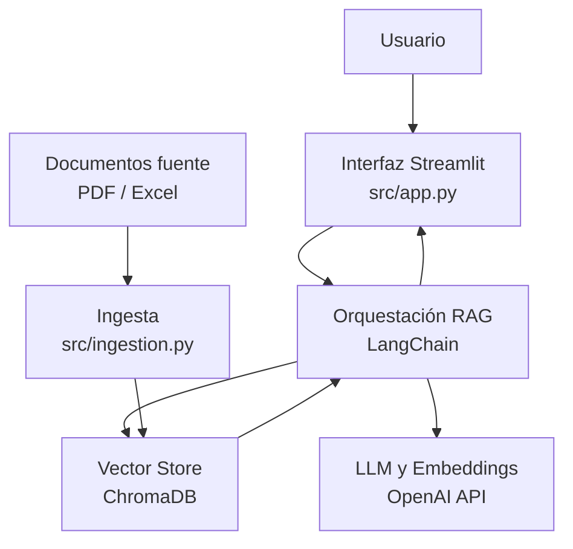

# mercado-central-ai-agent


Asistente conversacional con enfoque **RAG (Retrieval-Augmented Generation)** para consultar documentos del **Mercado Central**, construido con **LangChain**, **ChromaDB**, **OpenAI** y **Streamlit**.

---

## 🧠 Arquitectura



### Flujo general

1. Se cargan documentos (PDF/Excel) y se procesan con `src/ingestion.py`.
2. Los textos se fragmentan y se indexan en **ChromaDB**.
3. El usuario pregunta desde la app en **Streamlit**.
4. El pipeline **RAG** recupera contexto relevante desde ChromaDB.
5. Se construye el prompt y se consulta el modelo de **OpenAI**.
6. La respuesta se muestra en la interfaz, idealmente con citas/fuentes.

---

## 🚀 Instalación local

### Requisitos previos

- Python 3.11+
- Git
- Cuenta de OpenAI (embeddings y LLM)

### Paso a paso

1. **Clonar el repositorio**

```bash
git clone https://github.com/fren43051/mercado-central-ai-agent.git
cd mercado-central-ai-agent
```

2. **Crear y activar entorno virtual**

```bash
python -m venv venv

# Linux/Mac
source venv/bin/activate

# Windows
venv\Scripts\activate
```

3. **Instalar dependencias**

```bash
pip install -r requirements.txt
```

4. **Configurar variables de entorno**

```bash
cp .env.example .env
```

Editar `.env`:

```env
OPENAI_API_KEY=sk-...
CHROMA_PERSIST_DIR=./chroma_db
DOCS_DIR=./docs
```

5. **Indexar documentos** (solo la primera vez)

```bash
python src/ingestion.py
```

6. **Iniciar la aplicación**

```bash
streamlit run src/app.py
```

Abrir en: [http://localhost:8501](http://localhost:8501)

---

## ☁️ Deploy en OCI

### Servicios utilizados

- **OCI Container Registry (OCIR)**: almacenamiento de imagen Docker
- **OCI Container Instances**: ejecución del contenedor sin gestionar VMs
- **OCI Object Storage**: almacenamiento de documentos fuente
- **OCI Vault**: gestión de credenciales y API keys

### Flujo de despliegue

1. **Build de imagen**

```bash
docker build -t mercado-central-ai-agent:latest .
```

2. **Tag y push a OCIR**

```bash
docker tag mercado-central-ai-agent:latest \
  <region>.ocir.io/<namespace>/mercado-central-ai-agent:latest

docker push <region>.ocir.io/<namespace>/mercado-central-ai-agent:latest
```

3. **Crear Container Instance**

```bash
oci container-instances container-instance create \
  --compartment-id <compartment-id> \
  --display-name mercado-central-ai-agent \
  --containers '[{"imageUrl":"<region>.ocir.io/<namespace>/mercado-central-ai-agent:latest"}]' \
  --shape CI.Standard.E4.Flex \
  --shape-config '{"ocpus": 1, "memoryInGBs": 4}'
```

Documentación: [OCI Container Instances](https://docs.oracle.com/en-us/iaas/container-instances/index.html)

---

## 🖼️ Capturas de pantalla y demo

### 📸 Capturas de pantalla

> Reemplaza estos archivos por las imágenes reales de la aplicación ya desplegada.

<p align="center">
  
</p>

<p align="center">
  
</p>

<p align="center">
  
</p>

<p align="center">
  
</p>

### 🎥 Video demo

> Puedes usar un video embebido, una miniatura enlazada o un simple enlace externo.

#### Opción 1: miniatura enlazada

<p align="center">
  <a href="URL_DEL_VIDEO" target="_blank">
    
  </a>
</p>

#### Opción 2: iframe para video embebido

<p align="center">
  <iframe width="800" height="450" src="URL_EMBED_DEL_VIDEO" title="Demo del proyecto" frameborder="0" allow="accelerometer; autoplay; clipboard-write; encrypted-media; gyroscope; picture-in-picture" allowfullscreen></iframe>
</p>

> Si tu plataforma no renderiza `iframe` en Markdown, usa la miniatura enlazada o un enlace directo.

---

## 💬 Ejemplos de preguntas al agente

### Preguntas generales

- ¿Cuáles son los horarios de atención del Mercado Central?
- ¿Cómo puedo llegar al Mercado Central?
- ¿Qué requisitos existen para trabajar o vender en el mercado?
- ¿Qué productos se venden con mayor frecuencia?
- ¿Qué información hay sobre proveedores o locales?

### Preguntas sobre documentos

- ¿Qué documentos contiene la base de conocimiento?
- ¿Puedes resumirme la información más importante de este documento?
- ¿Qué datos relevantes encuentras sobre precios o productos?
- ¿Cuáles son las normas o recomendaciones para los visitantes?
- ¿Qué fuentes utilizaste para responder esta consulta?

> Puedes agregar más ejemplos conforme crezca la base documental del agente.

---

## 📊 Convención de commits

El proyecto usa [Conventional Commits](https://www.conventionalcommits.org/es/v1.0.0/):

- `feat:` nuevas funcionalidades
- `fix:` correcciones
- `docs:` documentación
- `chore:` tareas de mantenimiento/configuración

---

## 🛠️ Tecnologías

| Tecnología | Uso |
|---|---|
| [Python 3.11](https://python.org) | Lenguaje base |
| [LangChain](https://langchain.com) | Orquestación del pipeline RAG |
| [OpenAI API](https://openai.com) | Embeddings + LLM (GPT-4o-mini) |
| [ChromaDB](https://trychroma.com) | Base de datos vectorial |
| [Streamlit](https://streamlit.io) | Interfaz web del chat |
| [Docker](https://docker.com) | Containerización |
| [Oracle Cloud (OCI)](https://oracle.com/cloud) | Despliegue en la nube |
| [PyPDFLoader](https://python.langchain.com) | Extracción de PDFs |
| [UnstructuredExcelLoader](https://python.langchain.com) | Extracción de Excel |

---

## 👤 Autor

**Nelson Enrique Reyes Fabián**

- GitHub: [@nelsonenriquereyesfabian](https://github.com/nelsonenriquereyesfabian)
- Challenge: [Alura Agentes ONE IA FOR TECH](https://app.aluracursos.com/course/challenge-rag)

---

## 📄 Licencia

Este proyecto está bajo licencia [MIT](LICENSE).

---

<p align="center">
  Desarrollado como parte del <strong>Challenge AluraAgente - ONE IA FOR TECH</strong> 🚀
</p>
